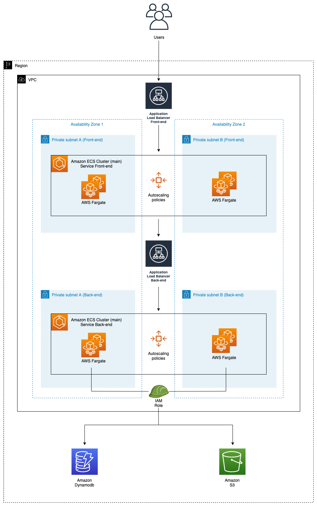

# Amazon ECS Fullstack App - Self Practice Implementation

## Current Implementation Status

This project is a fork of [repo](https://github.com/aws-samples/amazon-ecs-fullstack-app-terraform)

### ✅ Completed Documentation

#### Core Infrastructure
- [x] **[Main Implementation Guide](./IMPLEMENTATION_GUIDE.md)** - Complete overview and step-by-step instructions
- [x] **[Core Terraform Configuration](./Infrastructure/docs/01-core-terraform.md)** - versions.tf, variables.tf, main.tf, outputs.tf
- [x] **[Networking Module](Infrastructure/Modules/networking/02-networking-module.md)** - VPC, subnets, gateways, routing
- [x] **[Security Module](./Infrastructure/docs/03-security-module.md)** - Security groups and network access control
- [x] **[IAM Module](./Infrastructure/docs/04-iam-module.md)** - Roles and policies for ECS and CI/CD services
- [x] **[ECR Module](./Infrastructure/docs/05-ecr-module.md)** - Container repositories with lifecycle policies
- [x] **[S3 Module](./Infrastructure/docs/09-s3-module.md)** - Artifacts and assets buckets
- [x] **[DynamoDB Module](./Infrastructure/docs/08-dynamodb-module.md)** - Database for application data

### 🚧 Pending Documentation

#### Container Infrastructure
- [ ] **ECS Module** - ECS cluster, services, task definitions, auto-scaling
- [ ] **ALB Module** - Application Load Balancers, target groups, listeners

#### CI/CD Pipeline
- [ ] **CodeBuild Module** - Build projects and specifications
- [ ] **CodeDeploy Module** - Blue/Green deployment configuration
- [ ] **CodePipeline Module** - Complete CI/CD pipeline orchestration

#### Monitoring & Notifications
- [ ] **SNS Module** - Notification topics and subscriptions

#### Application Code
- [ ] **Backend Application** - Node.js API with Swagger
- [ ] **Frontend Application** - Vue.js client application

#### Templates & Configuration
- [ ] **Task Definition Templates** - ECS task definition JSON templates
- [ ] **Build Specifications** - CodeBuild buildspec.yml files

#### Deployment & Testing
- [ ] **Deployment Instructions** - Step-by-step deployment guide
- [ ] **Testing & Validation** - Load testing and validation procedures
- [ ] **Cleanup Instructions** - Resource cleanup and cost optimization

## Project Structure

```
aws-ecs-fullstack-app-terraform-seft-practice/
├── README.md                           ✅ Current status
├── IMPLEMENTATION_GUIDE.md             ✅ Main guide
├── .gitignore                          ✅ Git ignore rules
├── Code/
│   ├── client/                         📁 Vue.js frontend (pending)
│   ├── server/                         📁 Node.js backend (pending)
│   └── docs/                           📁 Application documentation (pending)
├── Infrastructure/
│   ├── main.tf                         📄 Main Terraform config (pending)
│   ├── variables.tf                    📄 Input variables (pending)
│   ├── outputs.tf                      📄 Output values (pending)
│   ├── versions.tf                     📄 Provider versions (pending)
│   ├── Modules/                        📁 Terraform modules
│   │   ├── networking/                 📁 VPC and networking (pending implementation)
│   │   ├── security/                   📁 Security groups (pending implementation)
│   │   ├── iam/                        📁 IAM roles and policies (pending implementation)
│   │   ├── ecr/                        📁 Container repositories (pending implementation)
│   │   ├── ecs/                        📁 Container orchestration (pending)
│   │   ├── alb/                        📁 Load balancers (pending)
│   │   ├── codebuild/                  📁 Build projects (pending)
│   │   ├── codedeploy/                 📁 Deployment config (pending)
│   │   ├── codepipeline/               📁 CI/CD pipeline (pending)
│   │   ├── s3/                         📁 Storage buckets (pending implementation)
│   │   ├── dynamodb/                   📁 Database (pending implementation)
│   │   └── sns/                        📁 Notifications (pending)
│   ├── Templates/                      📁 Configuration templates (pending)
│   └── docs/                           📁 Infrastructure documentation
│       ├── 01-core-terraform.md        ✅ Core Terraform setup
│       ├── 02-networking-module.md     ✅ Networking infrastructure
│       ├── 03-security-module.md       ✅ Security configuration
│       ├── 04-iam-module.md            ✅ IAM roles and policies
│       ├── 05-ecr-module.md            ✅ Container repositories
│       ├── 08-dynamodb-module.md       ✅ Database configuration
│       ├── 09-s3-module.md             ✅ Storage buckets
│       ├── 06-ecs-module.md            📄 ECS configuration (pending)
│       ├── 07-alb-module.md            📄 Load balancer config (pending)
│       ├── 10-codebuild-module.md      📄 Build projects (pending)
│       ├── 11-codedeploy-module.md     📄 Deployment config (pending)
│       ├── 12-codepipeline-module.md   📄 CI/CD pipeline (pending)
│       └── 13-sns-module.md            📄 Notifications (pending)
├── Documentation_assets/               📁 Architecture diagrams (pending)
└── docs/                              📁 General documentation (pending)
    ├── 18-deployment.md               📄 Deployment instructions (pending)
    ├── 19-testing.md                 📄 Testing procedures (pending)
    └── 20-cleanup.md                 📄 Cleanup instructions (pending)
```

## Getting Started

1. **Start with the main guide**: Read [IMPLEMENTATION_GUIDE.md](./IMPLEMENTATION_GUIDE.md) for the complete overview

2. **Follow the documentation in order**:
   - Begin with [Core Terraform Configuration](./Infrastructure/docs/01-core-terraform.md)
   - Continue with [Networking Module](Infrastructure/Modules/networking/02-networking-module.md)
   - Follow the sequence as outlined in the main guide

3. **Implement each module step by step**:
   - Each module documentation contains complete implementation instructions
   - Test each module before proceeding to the next
   - Use `terraform plan` to validate configurations

## Architecture Overview

The Infrastructure folder contains the terraform code to deploy the AWS resources. The *Modules* folder has been created to store the Terraform modules used in this project. The *Templates* folder contains the different configuration files needed within the modules. The Terraform state is stored locally in the machine where you execute the terraform commands, but feel free to set a Terraform backend configuration like an AWS S3 Bucket or Terraform Cloud to store the state remotely. The AWS resources created by the script are detailed bellow:

- AWS Networking resources, following best practices for HA
- 2 ECR Repositories
- 1 ECS Cluster
- 2 ECS Services
- 2 Task definitions
- 4 Autoscaling Policies + Cloudwatch Alarms
- 2 Application Load Balancer (Public facing)
- IAM Roles and policies for ECS Tasks, CodeBuild, CodeDeploy and CodePipeline
- Security Groups for ALBs and ECS tasks
- 2 CodeBuild Projects
- 2 CodeDeploy Applications
- 1 CodePipeline pipeline
- 2 S3 Buckets (1 used by CodePipeline to store the artifacts and another one used to store assets accessible from within the application)
- 1 DynamoDB table (used by the application)
- 1 SNS topic for notifications

## Infrastructure Architecture

The following diagram represents the Infrastructure architecture being deployed with this project:

<p align="center">
  
</p>

### Infrastructure considerations due to demo proposals
The task definition template (Infrastructure/Templates/taskdef.json) that enables the CodePipeline to execute a Blue/Green deployment in ECS has hardcoded values for the memory and CPU values for the server and client application.

Feel free to change it, by adding for example a set of "sed" commands in CodeBuild (following the ones already provided as example) to replace the values dynamically.

Feel free to create a subscriptor for the SNS topic created by this code, in order to get informed of the status of each finished CodeDeploy deployment.

## CI/CD Architecture

The following diagram represents the CI/CD architecture being deployed with this project:

<p align="center">
  
</p>

## Prerequisites

- AWS CLI configured with appropriate credentials
- Terraform >= 0.13 installed
- GitHub personal access token
- Node.js and npm (for local development)
- Docker (for local testing)

## Next Steps

Continue with the remaining module documentation to complete the implementation:

1. **ECS Module** - Container orchestration
2. **ALB Module** - Load balancing
3. **CodeBuild Module** - Build automation
4. **CodeDeploy Module** - Deployment automation
5. **CodePipeline Module** - CI/CD orchestration
6. **Application Code** - Frontend and backend implementation

## Notes

- This is a learning/demo project - review security settings before production use
- Monitor AWS costs during implementation
- Each module builds upon previous ones - follow the sequence
- Test thoroughly at each step

## Support

Refer to the individual module documentation for detailed implementation instructions and troubleshooting guidance.
